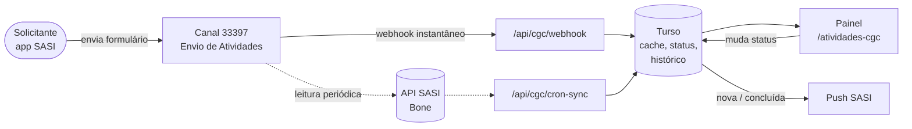
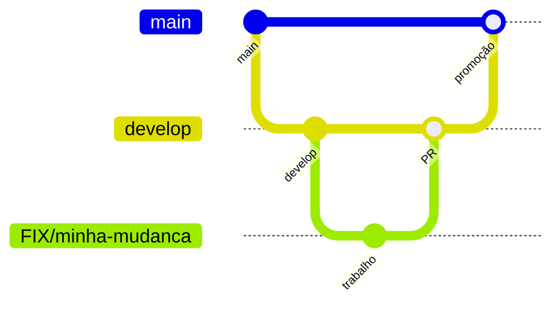

<div align="center">


# Atividades do CGC

**Painel de acompanhamento das atividades enviadas pelo app SASI ao CGC e aos núcleos parceiros.**

As solicitações chegam pelo canal SASI, são separadas por equipe e ganham status, observações e histórico.

[](https://cgc-atividades.vercel.app)


</div>

---

## Sumário

- [O que é](#o-que-é)
- [Funcionalidades](#funcionalidades)
- [Como funciona](#como-funciona)
- [Rodando localmente](#rodando-localmente)
- [Configuração](#configuração)
- [Estrutura do projeto](#estrutura-do-projeto)
- [API](#api)
- [Fluxo de trabalho](#fluxo-de-trabalho)

## O que é

Quem precisa de algo do CGC abre uma solicitação pelo app **SASI** (canal *Envio de Atividades*). O formulário indica para qual equipe vai o pedido, o prazo e a descrição.

Este sistema reúne essas solicitações e dá a cada equipe a sua própria fila, onde ela acompanha o andamento de cada atividade.

A API do SASI usada aqui só tem permissão de **leitura**. Por isso, status, observações e histórico ficam guardados no banco do próprio sistema, e o SASI continua sendo a fonte das mensagens.

### Equipes


Todas leem o mesmo canal. O que separa uma equipe da outra é o campo *Equipe* preenchido no formulário.

## Funcionalidades

| | |
|---|---|
| **Fila por equipe** | Tela inicial com as cinco equipes e o total de solicitações de cada uma. |
| **Status da atividade** | Não iniciado → Em andamento → Concluído, com cores padronizadas. |
| **Observações** | Comentários internos em cada atividade. |
| **Histórico** | Registro de toda mudança de status: quem mudou, quando e de qual status para qual. |
| **Prazo** | Lido direto do formulário do SASI e exibido em cada atividade. |
| **Anexos** | Arquivos enviados junto com a solicitação, com acesso direto. |
| **Busca** | Por descrição ou por nome de quem solicitou. |
| **Tempo real** | Atividade nova entra na hora via webhook; a tela também se atualiza a cada 15 s. |
| **Notificação push** | Aviso no app SASI quando chega uma atividade nova e quando uma é concluída. |

## Como funciona



- **Dois caminhos de entrada.** O webhook grava a atividade assim que ela é enviada. O sync periódico pela API cobre o que o webhook não trouxer. Uma atividade vinda pelos dois caminhos é gravada uma vez só e gera um único aviso.
- **Status local.** A permissão de leitura não permite alterar a mensagem no SASI, então o status de trabalho de cada atividade é salvo aqui, a partir do id da mensagem.
- **Acesso.** O sistema é aberto por um link com `?sasi-token=`, validado no mesmo serviço de login do `cgc-checklist`. Depois do primeiro acesso, o token fica na sessão do navegador e sai da URL.
- **Apps vizinhos.** O `cgc-checklist` mostra dados daqui no relatório `/controle`, pelas rotas `/api/controle/cgc*`, protegidas por segredo compartilhado. O webhook também recebe o canal do IDR (36602) e grava no banco do `cgc-idr`.

## Rodando localmente

**Pré-requisitos:** Node.js 20+ e um `.env.local` configurado (veja [Configuração](#configuração)).

```bash
npm install
npm run dev
```

Abra `http://localhost:3000/?sasi-token=SEU_TOKEN`. O token é obrigatório também em ambiente local, e sem `AUTH_USER_ENDPOINT` todo acesso é recusado.

<details>
<summary><b>Com Docker</b></summary>

```bash
docker compose --profile dev up    # hot-reload em http://localhost:3001
docker compose --profile prod up   # build de produção
```

No Windows, o perfil `dev` já liga `WATCHPACK_POLLING=true`, porque o bind mount via WSL2 não propaga eventos de arquivo.

</details>

| Comando | O que faz |
|---|---|
| `npm run dev` | Servidor de desenvolvimento |
| `npm run build` | Build de produção |
| `npm run lint` | ESLint |
| `npm test` | Testes (Vitest) |

## Configuração

Copie `.env.example` para `.env.local` e preencha. Cada variável está explicada no próprio arquivo.

| Variável | Para quê |
|---|---|
| `TURSO_DATABASE_URL` / `TURSO_AUTH_TOKEN` | Banco próprio do sistema |
| `AUTH_USER_ENDPOINT` | Validação do `sasi-token` de quem acessa |
| `SASI_API_TOKEN` | Token `pat_` de leitura da API SASI (escopo `READ_MESSAGES`) |
| `CGC_WEBHOOK_SECRET` | Autentica o webhook cadastrado no painel SASI |
| `CGC_CRON_SECRET` | Autentica o sync periódico externo |
| `CONTROLE_PROXY_SECRET` / `CGC_IDR_PROXY_SECRET` | Autenticam o `cgc-checklist` e o `cgc-idr` nas rotas `/api/controle/cgc*` |
| `SASI_NOTIFY_TOKEN` | Liga o push; sem ele, a notificação fica desligada |
| `CGC_DISPLAY_CUTOFF_DATE` | Opcional. Data (`AAAA-MM-DD`) a partir da qual as atividades aparecem na listagem; o padrão é hoje |

> Os nomes dos campos do formulário (equipe, prazo, prioridade, descrição) podem ser trocados por variável de ambiente (`SASI_CGC_FIELD_*`), sem precisar de deploy.

## Estrutura do projeto

```text
src/
├── app/
│   ├── atividades-cgc/          # telas: seleção de equipe, fila e /historico
│   └── api/
│       ├── cgc/                 # rotas usadas pelo painel + webhook e cron
│       └── controle/cgc/        # leitura para o cgc-checklist e o cgc-idr
├── hooks/useSasiToken.ts        # token da URL → sessionStorage
└── lib/
    ├── sasi-api/                # único ponto que fala com a API SASI (+ notify)
    ├── cgc/                     # grupos, mapeamento, cache, status, histórico
    ├── checklist-status.ts      # vocabulário e cores de status
    ├── auth.ts · api-auth.ts    # validação do sasi-token
    └── db.ts                    # cliente Turso + criação/migração das tabelas
```

## API

| Rota | Autenticação | Uso |
|---|---|---|
| `GET /api/cgc/groups` | `x-sasi-token` | Equipes e total de solicitações |
| `GET` · `PATCH /api/cgc/activities` | `x-sasi-token` | Listagem de uma equipe · troca de status |
| `/api/cgc/observations` | `x-sasi-token` | Observações da atividade |
| `GET /api/cgc/history` | `x-sasi-token` | Histórico de mudanças de status |
| `POST /api/cgc/webhook` | `CGC_WEBHOOK_SECRET` | Recebe os eventos do SASI |
| `GET /api/cgc/cron-sync` | `CGC_CRON_SECRET` | Sync periódico de todas as equipes |
| `GET /api/controle/cgc` · `/activities` | `CONTROLE_PROXY_SECRET` | Leitura para o `cgc-checklist` |
| `GET /api/controle/cgc/idr` | `CGC_IDR_PROXY_SECRET` | Leitura do canal IDR para o `cgc-idr` |

## Fluxo de trabalho



1. Crie uma branch a partir da `develop` com o prefixo `FIX/` (vale para qualquer mudança, não só correção). Exemplo: `FIX/add-lucide-icons`.
2. Abra um PR para `develop` com uma seção `## Summary`.
3. A `develop` é promovida para `main` num passo separado. Use **Create a merge commit**, e não squash, para que a `develop` e a `main` não entrem em conflito.

---

<div align="center">
<sub>Interface, código e comentários em português do Brasil · parte do ecossistema SASI / CGC</sub>
</div>
